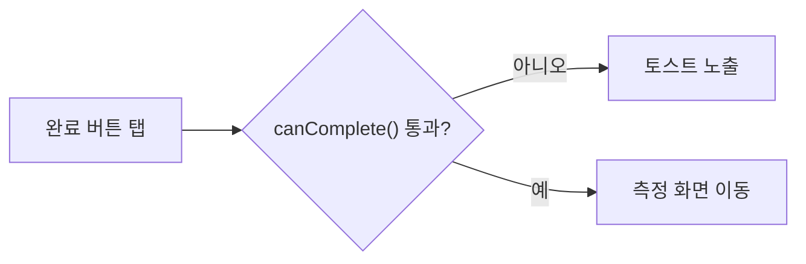
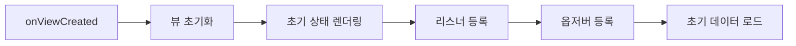
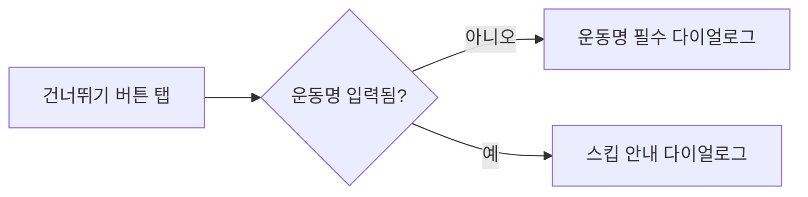
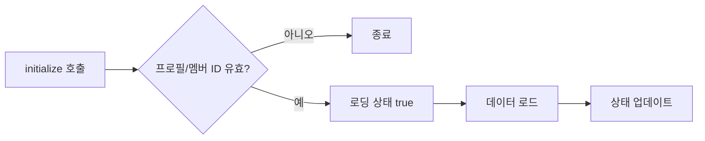
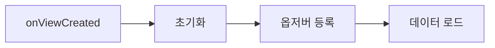
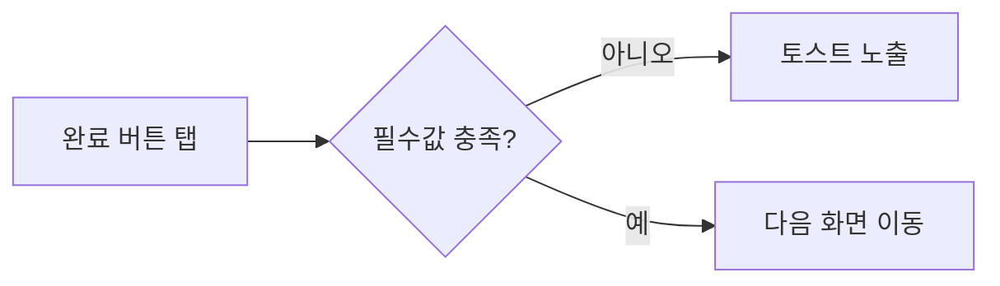

# Mermaid Guidelines

## Default Style
- Use `flowchart LR` by default.
- Put all node text in double quotes.
- Keep labels short enough to scan quickly.
- Write the final explanation and labels in Korean by default unless another language is requested.

## Recommended Node Patterns
- Start or entry: `A["화면 진입"]`
- Action: `B["초기화 실행"]`
- Decision: `C{"필수값 입력 완료?"}`
- Navigation: `D["측정 화면 이동"]`
- Dialog or bottom sheet: `E["설정 불러오기 다이얼로그 오픈"]`
- State update: `F["ViewModel 상태 업데이트"]`

## Edge Rules
- Put branch conditions on the edge.
- Example:


## Android Fragment Patterns

### 1. Fragment 초기화 흐름


### 2. 화면 내 버튼 분기


### 3. ViewModel 핵심 로직


## Splitting Strategy
- One diagram for lifecycle and initialization.
- One diagram for major user actions.
- One diagram for ViewModel or UseCase branching if the UI calls into meaningful business logic.
- Split when a single diagram exceeds roughly 12 to 15 nodes or mixes unrelated concerns.

## What to Omit
- Trivial setter calls with no branch impact.
- Pure formatting helpers unless they affect business-visible branches.
- Boilerplate lifecycle cleanup unless the user asked for it.

## Output Template
```md
### Fragment 초기화 플로우



### 완료 버튼 플로우


```
